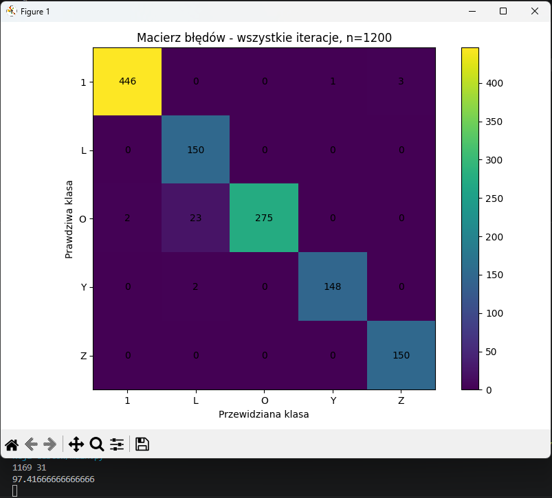

# Detekcja gestów
## Autorzy
Kamil Śliwa, Kamil Węgrzyn, Marcin Wiśniowski, Sławomir Zdunek

## Opis
Projekt rozpoznający wybrane statyczne gesty dłoni na podstawie obrazów z bazy danych oraz własnych zdjęć testowych z zastosowaniem klasycznych metod wizji komputerowej, m.in.:
-konwersja obrazu do przestrzeni HSV,
-binaryzacja obrazu,
-operacje morfologiczne otwarcia i zamknięcia,
-detekcja konturów,
-wyznaczanie otoczki wypukłej Convex Hull,
-analiza defektów wypukłości Convexity Defects,
-ekstrakcja cech geometrycznych dłoni,
-klasyfikacja metodą k-NN.

Celem projektu jest sprawdzenie skuteczności klasycznych metod wizji komputerowej w zadaniu rozpoznawania gestów dłoni oraz porównanie ich z modelem YOLOv8.

Program uczy się na zdjęciach wykonanych na jednolitym tle, z dobrym oświetleniem, odcięte na wysokości nadgarstka. 

## Rozpoznawane gesty
-kciuk w górę,
-litera L,
-gest „okej”,
-gest „róg”,
-palec wskazujący skierowany w górę

## Przykład wyniku
Przykładowy wynik działania programu:
```text
2136 114
94.93
```
Oznacza to:

2136 poprawnych klasyfikacji,
114 błędnych klasyfikacji,
dokładność równą 94.93%.

## Instrukcja instalacji i uruchomienia
Należy zainstalować Python na komputer (tutorial, jak to zrobić): https://wiki.python.org/moin/BeginnersGuide(2f)Download.html

Następnie pobrać pliki z tego repozytorium do folderu.

W folderze otworzyć konsolę i wpisać komendy:
`pip install opencv-python`,
`pip install numpy`,
`pip install matplotlib`.


Jeżeli komendy nie działają, najprawdopodobniej należy zainstalować pakiet instalacyjny pip: https://pip.pypa.io/en/stable/installation/

Na końcu można odpalić już projekt wpisując w konsolę: `py main.py`.
